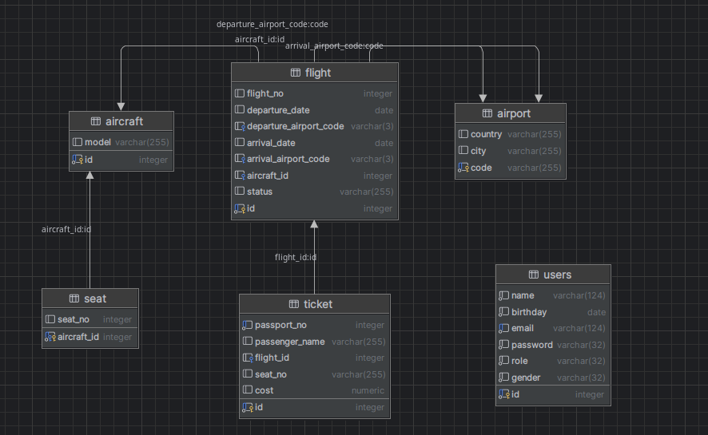

# Flight Application - приложение просмотра авиабилетов
## Описание проекта
Flight Application - это небольшое веб приложение
Для просмотра уже существующих в базе данных авиабилетов. А также возможностью
авторизации и аутентификации.

## Основные возможности
✅ Регистрация и аутентификация пользователей(а также их дальнейшая авторизация)\
✅ Проверка валидности данных пользователя\
✅ Возможность совершать Logout\
✅ Обработка ошибок

## Технологический стек
### Backend
- Java 17
- JDBC
- PostgreSQL (реляционная БД)
- Servlet API(веб-слой)

### Frontend
- JSP (шаблонизация)
- HTML/CSS/JS (базовый интерфейс)

### Инструменты
- Maven (сборка)
- Git (контроль версий)
- Tomcat (контейнер сервлетов)

## Цель
Основная цель проекта состояла в изучении:
- Чистого JDBC
- Простых SQL запросов в DAO слое
- Ручной настройки Tomcat(version - 10.1.39)
- JSP и HTML
- MVC Паттерна

### Структура бд

### Использование приложения
- Запуск Tomcat сервера
- начало работы по ссылке http://localhost:8080/registration